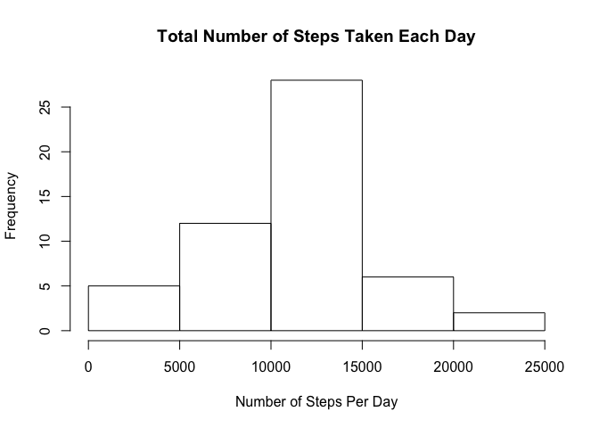
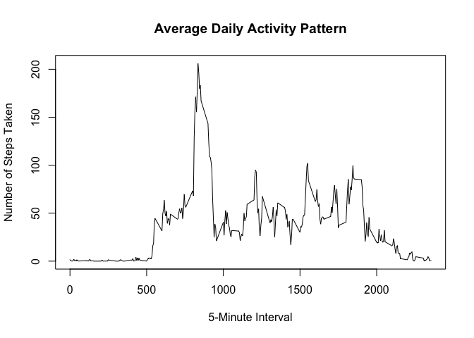
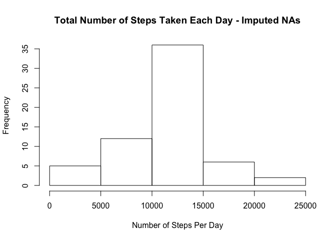
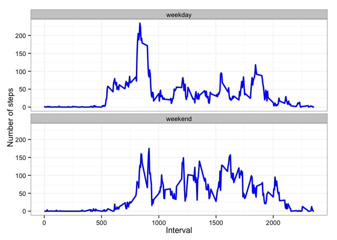

# Reproducible Research: Peer Assessment 1


## Loading and preprocessing the data

### Load the Data

```r
setwd("/Users/saraheneff/Desktop/Coursera R Directory")
data <- read.csv("activity.csv")
```

### Process/transform the data (if necessary) into a format suitable for your analysis

```r
library(lubridate)
data$date <- ymd(data$date)
data.clean <- na.omit(data)
```
## What is mean total number of steps taken per day?

### Calculate the total number of steps taken per day

```r
sum.day <- tapply(data.clean$steps, data.clean$date, sum)
sum.day
```

```
## 2012-10-02 2012-10-03 2012-10-04 2012-10-05 2012-10-06 2012-10-07 
##        126      11352      12116      13294      15420      11015 
## 2012-10-09 2012-10-10 2012-10-11 2012-10-12 2012-10-13 2012-10-14 
##      12811       9900      10304      17382      12426      15098 
## 2012-10-15 2012-10-16 2012-10-17 2012-10-18 2012-10-19 2012-10-20 
##      10139      15084      13452      10056      11829      10395 
## 2012-10-21 2012-10-22 2012-10-23 2012-10-24 2012-10-25 2012-10-26 
##       8821      13460       8918       8355       2492       6778 
## 2012-10-27 2012-10-28 2012-10-29 2012-10-30 2012-10-31 2012-11-02 
##      10119      11458       5018       9819      15414      10600 
## 2012-11-03 2012-11-05 2012-11-06 2012-11-07 2012-11-08 2012-11-11 
##      10571      10439       8334      12883       3219      12608 
## 2012-11-12 2012-11-13 2012-11-15 2012-11-16 2012-11-17 2012-11-18 
##      10765       7336         41       5441      14339      15110 
## 2012-11-19 2012-11-20 2012-11-21 2012-11-22 2012-11-23 2012-11-24 
##       8841       4472      12787      20427      21194      14478 
## 2012-11-25 2012-11-26 2012-11-27 2012-11-28 2012-11-29 
##      11834      11162      13646      10183       7047
```

### Make a histogram of the total number of steps taken each day

```r
hist(sum.day, main = "Total Number of Steps Taken Each Day", xlab = "Number of Steps Per Day")
```

 

### Calculate and report the mean and median of the total number of steps taken per day

```r
mean <- mean(sum.day, na.rm = TRUE)
median <- median(sum.day, na.rm = TRUE)
mean
```

```
## [1] 10766.19
```

```r
median
```

```
## [1] 10765
```

## What is the average daily activity pattern?

### Make a time series plot (i.e. type = "l") of the 5-minute interval (x-axis) and the average number of steps taken, averaged across all days (y-axis)

```r
data.clean$mean.steps <- tapply(data.clean$steps, data.clean$interval, mean)
data3 <- data.clean[,c(3,4)]
unique.intervals <- unique(data3)
plot(unique.intervals$interval, unique.intervals$mean.steps, type = "l", main = "Average Daily Activity Pattern", xlab = "5-Minute Interval", ylab = "Number of Steps Taken")
```

 

### Which 5-minute interval, on average across all the days in the dataset, contains the maximum number of steps?

```r
maxSteps <- max(unique.intervals$mean.steps)

interval.max.steps <- unique.intervals$interval[unique.intervals$mean.steps == maxSteps]

interval.max.steps
```

```
## [1] 835
```

## Imputing missing values

### Calculate and report the total number of missing values in the dataset (i.e. the total number of rows with NAs)

```r
NAs <- sum(is.na(data))
NAs
```

```
## [1] 2304
```

### Devise a strategy for filling in all of the missing values in the dataset. The strategy does not need to be sophisticated. For example, you could use the mean/median for that day, or the mean for that 5-minute interval, etc.

My chosen strategy is to replace the missing values in the dataset with the mean for that 5-minute interval.

### Create a new dataset that is equal to the original dataset but with the missing data filled in.

```r
data.imputed <- data
data.imputed$mean <- tapply(data.clean$steps, data.clean$interval, mean)
for(i in 1:17568) {
        if(is.na(data.imputed$steps[i]) == TRUE) { 
   data.imputed$steps[i] = data.imputed$mean[i]
   }
   }
```

### Make a histogram of the total number of steps taken each day and Calculate and report the mean and median total number of steps taken per day. Do these values differ from the estimates from the first part of the assignment? What is the impact of imputing missing data on the estimates of the total daily number of steps?

#### Histogram

```r
sum.day.imputed <- tapply(data.imputed$steps, data.imputed$date, sum)
hist(sum.day.imputed, main = "Total Number of Steps Taken Each Day - Imputed NAs", xlab = "Number of Steps Per Day")
```

 

#### Mean and Median Total Number of Steps Taken Per Day

```r
mean.imputed <- mean(sum.day.imputed, na.rm = TRUE)
median.imputed <- median(sum.day.imputed, na.rm = TRUE)

mean.imputed
```

```
## [1] 10766.19
```

```r
median.imputed
```

```
## [1] 10766.19
```

## Are there differences in activity patterns between weekdays and weekends?
Yes, from the data below, we can see that this user gets started later in the mornings on weekends but is generally more active during the day, with higher spikes and overall higher acitivy throughout the day.  During the week, the user starts earlier with an intial spike of activity in the morning but is generally more sendentary with some lower spikes of activity throughout the day.

### Create a new factor variable in the dataset with two levels – “weekday” and “weekend” indicating whether a given date is a weekday or weekend day.

```r
data.weekday <- data.clean
data.weekday$weekday <- weekdays(data.weekday$date, abbreviate = TRUE)
data.weekday$weekday.type <- ifelse(data.weekday$weekday %in% c("Sat", "Sun"), "weekend", "weekday")
```

### Make a panel plot containing a time series plot (i.e. type = "l") of the 5-minute interval (x-axis) and the average number of steps taken, averaged across all weekday days or weekend days (y-axis). See the README file in the GitHub repository to see an example of what this plot should look like using simulated data.

```r
## Preprocessing
data.weekday$weekday.type <- as.factor(data.weekday$weekday.type)

mean.steps.weekday <- aggregate(data.weekday$steps, by=list(interval = as.numeric(as.character(data.weekday$interval)), weekdays = data.weekday$weekday.type), FUN=mean)
colnames(mean.steps.weekday)[3] <- "steps"

## plots
library(ggplot2)
ggplot(mean.steps.weekday, aes(x=interval, y=steps)) + 
        geom_line(color="blue", size=1) + 
        facet_wrap(~ weekdays, nrow=2, ncol=1) +
        labs(x="Interval", y="Number of steps") +
        theme_bw()
```

 
